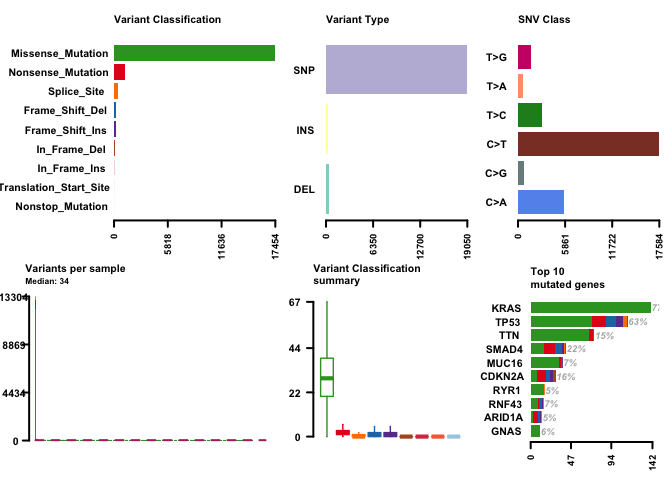

class 18
================

``` r
library(GenomicDataCommons)
```

    ## Loading required package: magrittr

    ## 
    ## Attaching package: 'GenomicDataCommons'

    ## The following object is masked from 'package:stats':
    ## 
    ##     filter

``` r
library(TCGAbiolinks)
library(maftools)
```

Hands on Section 1: Querying the GDC from R
-------------------------------------------

``` r
cases_by_project <- cases() %>%
  facet("project.project_id") %>%
  aggregations()
head(cases_by_project)
```

    ## $project.project_id
    ##               key doc_count
    ## 1           FM-AD     18004
    ## 2      TARGET-NBL      1127
    ## 3       TCGA-BRCA      1098
    ## 4      TARGET-AML       988
    ## 5       TARGET-WT       652
    ## 6        TCGA-GBM       617
    ## 7         TCGA-OV       608
    ## 8       TCGA-LUAD       585
    ## 9       TCGA-UCEC       560
    ## 10      TCGA-KIRC       537
    ## 11      TCGA-HNSC       528
    ## 12       TCGA-LGG       516
    ## 13      TCGA-THCA       507
    ## 14      TCGA-LUSC       504
    ## 15      TCGA-PRAD       500
    ## 16   NCICCR-DLBCL       489
    ## 17      TCGA-SKCM       470
    ## 18      TCGA-COAD       461
    ## 19      TCGA-STAD       443
    ## 20      TCGA-BLCA       412
    ## 21      TARGET-OS       381
    ## 22      TCGA-LIHC       377
    ## 23      TCGA-CESC       307
    ## 24      TCGA-KIRP       291
    ## 25      TCGA-SARC       261
    ## 26      TCGA-LAML       200
    ## 27      TCGA-ESCA       185
    ## 28      TCGA-PAAD       185
    ## 29      TCGA-PCPG       179
    ## 30      TCGA-READ       172
    ## 31      TCGA-TGCT       150
    ## 32  TARGET-ALL-P3       131
    ## 33      TCGA-THYM       124
    ## 34      TCGA-KICH       113
    ## 35       TCGA-ACC        92
    ## 36      TCGA-MESO        87
    ## 37       TCGA-UVM        80
    ## 38      TARGET-RT        75
    ## 39      TCGA-DLBC        58
    ## 40       TCGA-UCS        57
    ## 41      TCGA-CHOL        51
    ## 42    CTSP-DLBCL1        45
    ## 43    TARGET-CCSK        13
    ## 44 VAREPOP-APOLLO         7

Making a bar plot

``` r
x <- cases_by_project$project.project_id
head(x)
```

    ##          key doc_count
    ## 1      FM-AD     18004
    ## 2 TARGET-NBL      1127
    ## 3  TCGA-BRCA      1098
    ## 4 TARGET-AML       988
    ## 5  TARGET-WT       652
    ## 6   TCGA-GBM       617

``` r
colvec <- rep("lightblue", nrow(x))
#colvec[] <- "red"

barplot(x$doc_count, names.arg=x$key, las=2, log="y", col=colvec)
```


``` r
query <- GDCquery(project="TCGA-PAAD",
                  data.category="Transcriptome Profiling",
                  data.type="Gene Expression Quantification")
```

    ## --------------------------------------

    ## o GDCquery: Searching in GDC database

    ## --------------------------------------

    ## Genome of reference: hg38

    ## --------------------------------------------

    ## oo Accessing GDC. This might take a while...

    ## --------------------------------------------

    ## ooo Project: TCGA-PAAD

    ## --------------------

    ## oo Filtering results

    ## --------------------

    ## ooo By data.type

    ## ----------------

    ## oo Checking data

    ## ----------------

    ## ooo Check if there are duplicated cases

    ## Warning: There are more than one file for the same case. Please verify query results. You can use the command View(getResults(query)) in rstudio

    ## ooo Check if there results for the query

    ## -------------------

    ## o Preparing output

    ## -------------------

``` r
ans <- getResults(query)

head(ans)
```

    ##   data_release                      data_type
    ## 1  12.0 - 15.0 Gene Expression Quantification
    ## 2  12.0 - 15.0 Gene Expression Quantification
    ## 3  12.0 - 15.0 Gene Expression Quantification
    ## 4  12.0 - 15.0 Gene Expression Quantification
    ## 5  12.0 - 15.0 Gene Expression Quantification
    ## 6  12.0 - 15.0 Gene Expression Quantification
    ##                   updated_datetime
    ## 1 2018-11-30T10:59:48.252246+00:00
    ## 2 2018-11-30T10:59:48.252246+00:00
    ## 3 2018-11-30T10:59:48.252246+00:00
    ## 4 2018-11-30T10:59:48.252246+00:00
    ## 5 2018-11-30T10:59:48.252246+00:00
    ## 6 2018-11-30T10:59:48.252246+00:00
    ##                                              file_name
    ## 1  a9fbe593-42f7-4597-a61c-240408bbe203.FPKM-UQ.txt.gz
    ## 2     798e9f56-9964-4544-9d06-6a3aea20d0a6.FPKM.txt.gz
    ## 3 49895f4a-72ac-4d5e-ba56-8c8bb5de4758.htseq.counts.gz
    ## 4 8a799dfa-c1b5-4b13-9c91-6cbfe2abbc9f.htseq.counts.gz
    ## 5     3de80dcb-4ff2-4125-b8e6-9e06ec1cd833.FPKM.txt.gz
    ## 6  aec2e0c7-4792-41af-873c-3f3a53ec6d38.FPKM-UQ.txt.gz
    ##                                  submitter_id
    ## 1 a9fbe593-42f7-4597-a61c-240408bbe203_uqfpkm
    ## 2   798e9f56-9964-4544-9d06-6a3aea20d0a6_fpkm
    ## 3  49895f4a-72ac-4d5e-ba56-8c8bb5de4758_count
    ## 4  8a799dfa-c1b5-4b13-9c91-6cbfe2abbc9f_count
    ## 5   3de80dcb-4ff2-4125-b8e6-9e06ec1cd833_fpkm
    ## 6 aec2e0c7-4792-41af-873c-3f3a53ec6d38_uqfpkm
    ##                                file_id file_size
    ## 1 d8f93e42-ee62-4645-b9e1-9213b616cd4a    483470
    ## 2 7d5c3b75-c418-4cff-9a1c-bb51f7b15a15    513257
    ## 3 d257277b-072f-4b6c-bead-07332de2a533    253547
    ## 4 167aef29-9e90-4bd1-ab3c-49bdb9866939    260246
    ## 5 101e042e-efa2-4c6c-b629-55ecbde859d2    530992
    ## 6 a7a4ce1e-5c61-4ca9-9748-4d4efd77696e    522511
    ##                          cases                                   id
    ## 1 TCGA-FB-AAPP-01A-12R-A41B-07 d8f93e42-ee62-4645-b9e1-9213b616cd4a
    ## 2 TCGA-PZ-A5RE-01A-11R-A32O-07 7d5c3b75-c418-4cff-9a1c-bb51f7b15a15
    ## 3 TCGA-IB-AAUS-01A-12R-A38C-07 d257277b-072f-4b6c-bead-07332de2a533
    ## 4 TCGA-IB-8127-01A-11R-2404-07 167aef29-9e90-4bd1-ab3c-49bdb9866939
    ## 5 TCGA-H6-8124-11A-01R-2404-07 101e042e-efa2-4c6c-b629-55ecbde859d2
    ## 6 TCGA-HZ-8001-01A-11R-2204-07 a7a4ce1e-5c61-4ca9-9748-4d4efd77696e
    ##                   created_datetime                           md5sum
    ## 1 2016-05-26T21:15:08.582831-05:00 679185c94f03bd2d55e248bc4b41ba2e
    ## 2 2016-05-30T18:44:12.212489-05:00 2d6349b8cef47144ad467c5c7769794d
    ## 3 2016-05-29T10:41:56.268330-05:00 661f22b698d45a10f6c00e420c6a2fbd
    ## 4 2016-05-26T21:10:39.562381-05:00 fd8ed974721299c7fce17d0722d6e8e2
    ## 5 2016-05-30T18:25:48.027687-05:00 b114f332af48cacf4c6c68869191eb67
    ## 6 2016-05-29T10:30:41.863386-05:00 03949737031ebb660b819c929def4363
    ##   data_format access    state version           data_category
    ## 1         TXT   open released       1 Transcriptome Profiling
    ## 2         TXT   open released       1 Transcriptome Profiling
    ## 3         TXT   open released       1 Transcriptome Profiling
    ## 4         TXT   open released       1 Transcriptome Profiling
    ## 5         TXT   open released       1 Transcriptome Profiling
    ## 6         TXT   open released       1 Transcriptome Profiling
    ##              type experimental_strategy   project
    ## 1 gene_expression               RNA-Seq TCGA-PAAD
    ## 2 gene_expression               RNA-Seq TCGA-PAAD
    ## 3 gene_expression               RNA-Seq TCGA-PAAD
    ## 4 gene_expression               RNA-Seq TCGA-PAAD
    ## 5 gene_expression               RNA-Seq TCGA-PAAD
    ## 6 gene_expression               RNA-Seq TCGA-PAAD
    ##                            analysis_id        analysis_updated_datetime
    ## 1 de6fa61d-11ae-4959-a0e8-906d1967bdcb 2018-09-10T15:08:41.786316-05:00
    ## 2 78e7a580-6ea2-42c9-bf21-84f6f6c034b0 2018-09-10T15:08:41.786316-05:00
    ## 3 83aac111-5fb3-4445-ae12-6accb842f0d6 2018-09-10T15:08:41.786316-05:00
    ## 4 915b1e44-2f3b-4f64-a252-50781e6bc7f3 2018-09-10T15:08:41.786316-05:00
    ## 5 561a4631-7f68-43f4-9ce0-d27b23fabc6e 2018-09-10T15:08:41.786316-05:00
    ## 6 9dac0593-6b59-4a1f-9772-d950118c7853 2018-09-10T15:08:41.786316-05:00
    ##          analysis_created_datetime
    ## 1 2016-05-26T21:15:08.582831-05:00
    ## 2 2016-05-30T18:44:12.212489-05:00
    ## 3 2016-05-29T10:41:56.268330-05:00
    ## 4 2016-05-26T21:10:39.562381-05:00
    ## 5 2016-05-30T18:25:48.027687-05:00
    ## 6 2016-05-29T10:30:41.863386-05:00
    ##                         analysis_submitter_id analysis_state
    ## 1 a9fbe593-42f7-4597-a61c-240408bbe203_uqfpkm       released
    ## 2   798e9f56-9964-4544-9d06-6a3aea20d0a6_fpkm       released
    ## 3  49895f4a-72ac-4d5e-ba56-8c8bb5de4758_count       released
    ## 4  8a799dfa-c1b5-4b13-9c91-6cbfe2abbc9f_count       released
    ## 5   3de80dcb-4ff2-4125-b8e6-9e06ec1cd833_fpkm       released
    ## 6 aec2e0c7-4792-41af-873c-3f3a53ec6d38_uqfpkm       released
    ##                 analysis_workflow_link analysis_workflow_type
    ## 1 https://github.com/NCI-GDC/htseq-cwl        HTSeq - FPKM-UQ
    ## 2 https://github.com/NCI-GDC/htseq-cwl           HTSeq - FPKM
    ## 3 https://github.com/NCI-GDC/htseq-cwl         HTSeq - Counts
    ## 4 https://github.com/NCI-GDC/htseq-cwl         HTSeq - Counts
    ## 5 https://github.com/NCI-GDC/htseq-cwl           HTSeq - FPKM
    ## 6 https://github.com/NCI-GDC/htseq-cwl        HTSeq - FPKM-UQ
    ##   analysis_workflow_version   tissue.definition
    ## 1                        v1 Primary solid Tumor
    ## 2                        v1 Primary solid Tumor
    ## 3                        v1 Primary solid Tumor
    ## 4                        v1 Primary solid Tumor
    ## 5                        v1 Solid Tissue Normal
    ## 6                        v1 Primary solid Tumor

``` r
View(ans)
```

``` r
nrow(ans)
```

    ## [1] 546

``` r
maf.file <- GDCquery_Maf(tumor="PAAD", pipelines = "mutect")
```

    ## ============================================================================

    ##  For more information about MAF data please read the following GDC manual and web pages:

    ##  GDC manual: https://gdc-docs.nci.nih.gov/Data/PDF/Data_UG.pdf

    ##  https://gdc-docs.nci.nih.gov/Data/Bioinformatics_Pipelines/DNA_Seq_Variant_Calling_Pipeline/

    ##  https://gdc.cancer.gov/about-gdc/variant-calling-gdc

    ## ============================================================================

    ## --------------------------------------

    ## o GDCquery: Searching in GDC database

    ## --------------------------------------

    ## Genome of reference: hg38

    ## --------------------------------------------

    ## oo Accessing GDC. This might take a while...

    ## --------------------------------------------

    ## ooo Project: TCGA-PAAD

    ## --------------------

    ## oo Filtering results

    ## --------------------

    ## ooo By access

    ## ooo By data.type

    ## ooo By workflow.type

    ## ----------------

    ## oo Checking data

    ## ----------------

    ## ooo Check if there are duplicated cases

    ## ooo Check if there results for the query

    ## -------------------

    ## o Preparing output

    ## -------------------

    ## Downloading data for project TCGA-PAAD

    ## Of the 1 files for download 1 already exist.

    ## All samples have been already downloaded

``` r
head(maf.file)
```

    ## # A tibble: 6 x 120
    ##   Hugo_Symbol Entrez_Gene_Id Center NCBI_Build Chromosome Start_Position
    ##   <chr>                <int> <chr>  <chr>      <chr>               <int>
    ## 1 BCAN                 63827 BI     GRCh38     chr1            156651635
    ## 2 TNN                  63923 BI     GRCh38     chr1            175135891
    ## 3 PM20D1              148811 BI     GRCh38     chr1            205850012
    ## 4 CR1                   1378 BI     GRCh38     chr1            207523807
    ## 5 MLK4                 84451 BI     GRCh38     chr1            233372058
    ## 6 ITSN2                50618 BI     GRCh38     chr2             24310368
    ## # … with 114 more variables: End_Position <int>, Strand <chr>,
    ## #   Variant_Classification <chr>, Variant_Type <chr>,
    ## #   Reference_Allele <chr>, Tumor_Seq_Allele1 <chr>,
    ## #   Tumor_Seq_Allele2 <chr>, dbSNP_RS <chr>, dbSNP_Val_Status <chr>,
    ## #   Tumor_Sample_Barcode <chr>, Matched_Norm_Sample_Barcode <chr>,
    ## #   Match_Norm_Seq_Allele1 <lgl>, Match_Norm_Seq_Allele2 <lgl>,
    ## #   Tumor_Validation_Allele1 <chr>, Tumor_Validation_Allele2 <chr>,
    ## #   Match_Norm_Validation_Allele1 <lgl>,
    ## #   Match_Norm_Validation_Allele2 <lgl>, Verification_Status <lgl>,
    ## #   Validation_Status <lgl>, Mutation_Status <chr>,
    ## #   Sequencing_Phase <lgl>, Sequence_Source <lgl>,
    ## #   Validation_Method <chr>, Score <lgl>, BAM_File <lgl>, Sequencer <chr>,
    ## #   Tumor_Sample_UUID <chr>, Matched_Norm_Sample_UUID <chr>, HGVSc <chr>,
    ## #   HGVSp <chr>, HGVSp_Short <chr>, Transcript_ID <chr>,
    ## #   Exon_Number <chr>, t_depth <int>, t_ref_count <int>,
    ## #   t_alt_count <int>, n_depth <int>, n_ref_count <lgl>,
    ## #   n_alt_count <lgl>, all_effects <chr>, Allele <chr>, Gene <chr>,
    ## #   Feature <chr>, Feature_type <chr>, One_Consequence <chr>,
    ## #   Consequence <chr>, cDNA_position <chr>, CDS_position <chr>,
    ## #   Protein_position <chr>, Amino_acids <chr>, Codons <chr>,
    ## #   Existing_variation <chr>, ALLELE_NUM <int>, DISTANCE <dbl>,
    ## #   TRANSCRIPT_STRAND <int>, SYMBOL <chr>, SYMBOL_SOURCE <chr>,
    ## #   HGNC_ID <chr>, BIOTYPE <chr>, CANONICAL <chr>, CCDS <chr>, ENSP <chr>,
    ## #   SWISSPROT <chr>, TREMBL <chr>, UNIPARC <chr>, RefSeq <chr>,
    ## #   SIFT <chr>, PolyPhen <chr>, EXON <chr>, INTRON <chr>, DOMAINS <chr>,
    ## #   GMAF <dbl>, AFR_MAF <dbl>, AMR_MAF <dbl>, ASN_MAF <lgl>,
    ## #   EAS_MAF <dbl>, EUR_MAF <dbl>, SAS_MAF <dbl>, AA_MAF <dbl>,
    ## #   EA_MAF <dbl>, CLIN_SIG <chr>, SOMATIC <dbl>, PUBMED <chr>,
    ## #   MOTIF_NAME <lgl>, MOTIF_POS <lgl>, HIGH_INF_POS <lgl>,
    ## #   MOTIF_SCORE_CHANGE <lgl>, IMPACT <chr>, PICK <int>,
    ## #   VARIANT_CLASS <chr>, TSL <int>, HGVS_OFFSET <int>, PHENO <chr>,
    ## #   MINIMISED <int>, ExAC_AF <dbl>, ExAC_AF_Adj <dbl>, ExAC_AF_AFR <dbl>,
    ## #   ExAC_AF_AMR <dbl>, ExAC_AF_EAS <dbl>, ExAC_AF_FIN <dbl>, …

``` r
vars = read.maf(maf = maf.file, verbose = FALSE)
```

``` r
plotmafSummary(vars)
```



``` r
oncoplot(maf = vars, top = 10)
```


``` r
#not showing up on rstudio but it did save as a pdf in this class folder
```

``` r
# Oncoplot for our top 10 most frequently mutated genes
pdf("oncoplot_panc.pdf")
oncoplot(maf = vars, top = 10, fontSize = 12)
dev.off()
```

    ## quartz_off_screen 
    ##                 2

``` r
oncostrip(maf=vars, genes=c("KRAS", "TP53"))
```


``` r
lollipopPlot(vars, gene='KRAS')
```

    ## Assuming protein change information are stored under column HGVSp_Short. Use argument AACol to override if necessary.

    ## 2 transcripts available. Use arguments refSeqID or proteinID to manually specify tx name.

    ##    HGNC refseq.ID protein.ID aa.length
    ## 1: KRAS NM_004985  NP_004976       188
    ## 2: KRAS NM_033360  NP_203524       189

    ## Using longer transcript NM_033360 for now.


``` r
lollipopPlot(vars, gene='TP53')
```

    ## Assuming protein change information are stored under column HGVSp_Short. Use argument AACol to override if necessary.

    ## 8 transcripts available. Use arguments refSeqID or proteinID to manually specify tx name.

    ##    HGNC    refseq.ID   protein.ID aa.length
    ## 1: TP53    NM_000546    NP_000537       393
    ## 2: TP53 NM_001126112 NP_001119584       393
    ## 3: TP53 NM_001126118 NP_001119590       354
    ## 4: TP53 NM_001126115 NP_001119587       261
    ## 5: TP53 NM_001126113 NP_001119585       346
    ## 6: TP53 NM_001126117 NP_001119589       214
    ## 7: TP53 NM_001126114 NP_001119586       341
    ## 8: TP53 NM_001126116 NP_001119588       209

    ## Using longer transcript NM_000546 for now.


Hands on section 2:
-------------------

``` r
library(bio3d)
seqs <- read.fasta("lecture18_sequences.fa")
#seqs <- seqaln(seqs) already aligned so dont need really need this step
seqs
```

    ##              1        .         .         .         .         .         60 
    ## P53_wt       MEEPQSDPSVEPPLSQETFSDLWKLLPENNVLSPLPSQAMDDLMLSPDDIEQWFTEDPGP
    ## P53_mutant   MEEPQSDPSVEPPLSQETFSDLWKLLPENNVLSPLPSQAMLDLMLSPDDIEQWFTEDPGP
    ##              **************************************** ******************* 
    ##              1        .         .         .         .         .         60 
    ## 
    ##             61        .         .         .         .         .         120 
    ## P53_wt       DEAPRMPEAAPPVAPAPAAPTPAAPAPAPSWPLSSSVPSQKTYQGSYGFRLGFLHSGTAK
    ## P53_mutant   DEAPWMPEAAPPVAPAPAAPTPAAPAPAPSWPLSSSVPSQKTYQGSYGFRLGFLHSGTAK
    ##              **** ******************************************************* 
    ##             61        .         .         .         .         .         120 
    ## 
    ##            121        .         .         .         .         .         180 
    ## P53_wt       SVTCTYSPALNKMFCQLAKTCPVQLWVDSTPPPGTRVRAMAIYKQSQHMTEVVRRCPHHE
    ## P53_mutant   SVTCTYSPALNKMFCQLAKTCPVQLWVDSTPPPGTRVRAMAIYKQSQHMTEVVRRCPHHE
    ##              ************************************************************ 
    ##            121        .         .         .         .         .         180 
    ## 
    ##            181        .         .         .         .         .         240 
    ## P53_wt       RCSDSDGLAPPQHLIRVEGNLRVEYLDDRNTFRHSVVVPYEPPEVGSDCTTIHYNYMCNS
    ## P53_mutant   RCSDSDGLAPPQHLIRVEGNLRVEYLDDRNTFVHSVVVPYEPPEVGSDCTTIHYNYMCNS
    ##              ******************************** *************************** 
    ##            181        .         .         .         .         .         240 
    ## 
    ##            241        .         .         .         .         .         300 
    ## P53_wt       SCMGGMNRRPILTIITLEDSSGNLLGRNSFEVRVCACPGRDRRTEEENLRKKGEPHHELP
    ## P53_mutant   SCMGGMNRRPILTIITLEV-----------------------------------------
    ##              ******************                                           
    ##            241        .         .         .         .         .         300 
    ## 
    ##            301        .         .         .         .         .         360 
    ## P53_wt       PGSTKRALPNNTSSSPQPKKKPLDGEYFTLQIRGRERFEMFRELNEALELKDAQAGKEPG
    ## P53_mutant   ------------------------------------------------------------
    ##                                                                           
    ##            301        .         .         .         .         .         360 
    ## 
    ##            361        .         .         .  393 
    ## P53_wt       GSRAHSSHLKSKKGQSTSRHKKLMFKTEGPDSD
    ## P53_mutant   ---------------------------------
    ##                                                
    ##            361        .         .         .  393 
    ## 
    ## Call:
    ##   read.fasta(file = "lecture18_sequences.fa")
    ## 
    ## Class:
    ##   fasta
    ## 
    ## Alignment dimensions:
    ##   2 sequence rows; 393 position columns (259 non-gap, 134 gap) 
    ## 
    ## + attr: id, ali, call

``` r
## Calculate positional identity scores
ide <- conserv(seqs$ali, method="identity")
mutant.sites <- which(ide < 1) 

## Exclude gap possitions from analysis
gaps <- gap.inspect(seqs)
mutant.sites <- mutant.sites[mutant.sites %in% gaps$f.inds]

mutant.sites
```

    ## [1]  41  65 213 259

``` r
## Make a "names" label for our output sequences (one per mutant)
mutant.names <- paste0(seqs$ali["P53_wt",mutant.sites],
                       mutant.sites,
                       seqs$ali["P53_mutant",mutant.sites])

mutant.names
```

    ## [1] "D41L"  "R65W"  "R213V" "D259V"

``` r
## Sequence positions surounding each mutant site
start.position <- mutant.sites - 8
end.position <-  mutant.sites + 8

# Blank matrix to store sub-sequences
store.seqs <- matrix("-", nrow=length(mutant.sites), ncol=17)
rownames(store.seqs) <- mutant.names

## Extract each sub-sequence
for(i in 1:length(mutant.sites)) {
  store.seqs[i,] <- seqs$ali["P53_mutant",start.position[i]:end.position[i]]
}

store.seqs
```

    ##       [,1] [,2] [,3] [,4] [,5] [,6] [,7] [,8] [,9] [,10] [,11] [,12] [,13]
    ## D41L  "S"  "P"  "L"  "P"  "S"  "Q"  "A"  "M"  "L"  "D"   "L"   "M"   "L"  
    ## R65W  "D"  "P"  "G"  "P"  "D"  "E"  "A"  "P"  "W"  "M"   "P"   "E"   "A"  
    ## R213V "Y"  "L"  "D"  "D"  "R"  "N"  "T"  "F"  "V"  "H"   "S"   "V"   "V"  
    ## D259V "I"  "L"  "T"  "I"  "I"  "T"  "L"  "E"  "V"  "-"   "-"   "-"   "-"  
    ##       [,14] [,15] [,16] [,17]
    ## D41L  "S"   "P"   "D"   "D"  
    ## R65W  "A"   "P"   "P"   "V"  
    ## R213V "V"   "P"   "Y"   "E"  
    ## D259V "-"   "-"   "-"   "-"

``` r
## Output a FASTA file for further analysis
write.fasta(seqs=store.seqs, ids=mutant.names, file="subsequences.fa")
```

``` r
library(bio3d)

## Read KRas oncogene sequence from UniProt
wt <- get.seq("P01116")
```

    ## Warning in get.seq("P01116"): Removing existing file: seqs.fasta

``` r
## Here we make four mutants namely: G12V, Q22N, T74S and A130V
mutant <- wt
mutant$ali[ c(12,22,74,130)] <- c("V", "N", "S", "V")

write.fasta( seqbind(wt, mutant), ids=c("wt","mutant"), file="kras-sequences.fa")
```

``` r
sessionInfo()
```

    ## R version 3.5.2 (2018-12-20)
    ## Platform: x86_64-apple-darwin15.6.0 (64-bit)
    ## Running under: macOS Mojave 10.14.3
    ## 
    ## Matrix products: default
    ## BLAS: /Library/Frameworks/R.framework/Versions/3.5/Resources/lib/libRblas.0.dylib
    ## LAPACK: /Library/Frameworks/R.framework/Versions/3.5/Resources/lib/libRlapack.dylib
    ## 
    ## locale:
    ## [1] en_US.UTF-8/en_US.UTF-8/en_US.UTF-8/C/en_US.UTF-8/en_US.UTF-8
    ## 
    ## attached base packages:
    ## [1] parallel  stats     graphics  grDevices utils     datasets  methods  
    ## [8] base     
    ## 
    ## other attached packages:
    ## [1] bio3d_2.3-4              maftools_1.6.15         
    ## [3] Biobase_2.40.0           BiocGenerics_0.26.0     
    ## [5] TCGAbiolinks_2.8.4       GenomicDataCommons_1.4.3
    ## [7] magrittr_1.5            
    ## 
    ## loaded via a namespace (and not attached):
    ##   [1] changepoint_2.2.2           backports_1.1.3            
    ##   [3] circlize_0.4.5              aroma.light_3.10.0         
    ##   [5] NMF_0.21.0                  plyr_1.8.4                 
    ##   [7] selectr_0.4-1               ConsensusClusterPlus_1.44.0
    ##   [9] lazyeval_0.2.1              splines_3.5.2              
    ##  [11] BiocParallel_1.14.2         GenomeInfoDb_1.16.0        
    ##  [13] ggplot2_3.1.0               gridBase_0.4-7             
    ##  [15] sva_3.28.0                  digest_0.6.18              
    ##  [17] foreach_1.4.4               htmltools_0.3.6            
    ##  [19] fansi_0.4.0                 memoise_1.1.0              
    ##  [21] BSgenome_1.48.0             cluster_2.0.7-1            
    ##  [23] doParallel_1.0.14           limma_3.36.5               
    ##  [25] ComplexHeatmap_1.18.1       Biostrings_2.48.0          
    ##  [27] readr_1.3.1                 annotate_1.58.0            
    ##  [29] wordcloud_2.6               matrixStats_0.54.0         
    ##  [31] R.utils_2.8.0               prettyunits_1.0.2          
    ##  [33] colorspace_1.4-0            blob_1.1.1                 
    ##  [35] rvest_0.3.2                 rappdirs_0.3.1             
    ##  [37] ggrepel_0.8.0               xfun_0.4                   
    ##  [39] dplyr_0.8.0.1               crayon_1.3.4               
    ##  [41] RCurl_1.95-4.11             jsonlite_1.6               
    ##  [43] genefilter_1.62.0           survival_2.43-3            
    ##  [45] VariantAnnotation_1.26.1    zoo_1.8-4                  
    ##  [47] iterators_1.0.10            glue_1.3.0                 
    ##  [49] survminer_0.4.3             registry_0.5-1             
    ##  [51] gtable_0.2.0                zlibbioc_1.26.0            
    ##  [53] XVector_0.20.0              GetoptLong_0.1.7           
    ##  [55] DelayedArray_0.6.6          shape_1.4.4                
    ##  [57] scales_1.0.0                DESeq_1.32.0               
    ##  [59] DBI_1.0.0                   edgeR_3.22.5               
    ##  [61] rngtools_1.3.1              bibtex_0.4.2               
    ##  [63] ggthemes_4.1.0              Rcpp_1.0.0                 
    ##  [65] xtable_1.8-3                progress_1.2.0             
    ##  [67] cmprsk_2.2-7                mclust_5.4.2               
    ##  [69] bit_1.1-14                  matlab_1.0.2               
    ##  [71] km.ci_0.5-2                 stats4_3.5.2               
    ##  [73] httr_1.4.0                  RColorBrewer_1.1-2         
    ##  [75] pkgconfig_2.0.2             XML_3.98-1.17              
    ##  [77] R.methodsS3_1.7.1           utf8_1.1.4                 
    ##  [79] locfit_1.5-9.1              tidyselect_0.2.5           
    ##  [81] rlang_0.3.1                 reshape2_1.4.3             
    ##  [83] AnnotationDbi_1.42.1        munsell_0.5.0              
    ##  [85] tools_3.5.2                 cli_1.0.1                  
    ##  [87] downloader_0.4              generics_0.0.2             
    ##  [89] RSQLite_2.1.1               broom_0.5.1                
    ##  [91] evaluate_0.12               stringr_1.3.1              
    ##  [93] yaml_2.2.0                  knitr_1.21                 
    ##  [95] bit64_0.9-7                 survMisc_0.5.5             
    ##  [97] purrr_0.3.0                 EDASeq_2.14.1              
    ##  [99] nlme_3.1-137                R.oo_1.22.0                
    ## [101] xml2_1.2.0                  biomaRt_2.36.1             
    ## [103] compiler_3.5.2              curl_3.3                   
    ## [105] tibble_2.0.1                geneplotter_1.58.0         
    ## [107] stringi_1.2.4               GenomicFeatures_1.32.3     
    ## [109] lattice_0.20-38             Matrix_1.2-15              
    ## [111] KMsurv_0.1-5                pillar_1.3.1               
    ## [113] GlobalOptions_0.1.0         cowplot_0.9.4              
    ## [115] data.table_1.12.0           bitops_1.0-6               
    ## [117] rtracklayer_1.40.6          GenomicRanges_1.32.7       
    ## [119] R6_2.3.0                    latticeExtra_0.6-28        
    ## [121] hwriter_1.3.2               ShortRead_1.38.0           
    ## [123] gridExtra_2.3               IRanges_2.14.12            
    ## [125] codetools_0.2-15            assertthat_0.2.0           
    ## [127] SummarizedExperiment_1.10.1 pkgmaker_0.27              
    ## [129] rjson_0.2.20                withr_2.1.2                
    ## [131] GenomicAlignments_1.16.0    Rsamtools_1.32.3           
    ## [133] S4Vectors_0.18.3            GenomeInfoDbData_1.1.0     
    ## [135] mgcv_1.8-26                 hms_0.4.2                  
    ## [137] grid_3.5.2                  tidyr_0.8.3                
    ## [139] rmarkdown_1.11              ggpubr_0.2
